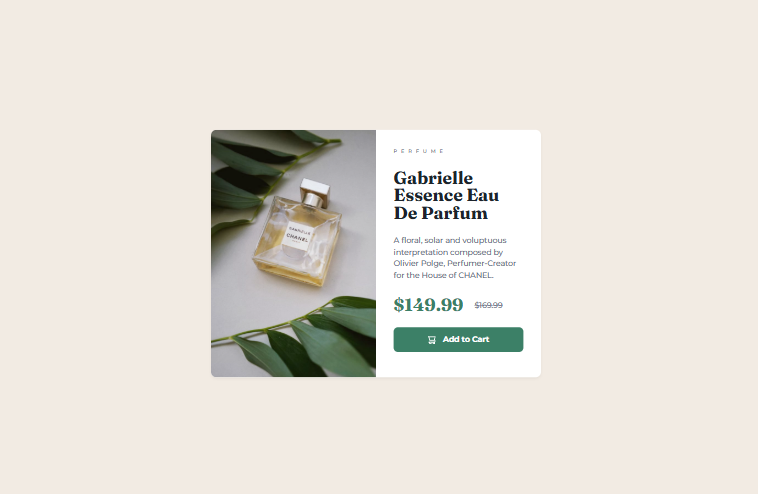

# Frontend Mentor - Product preview card component solution

This is a solution to the [Product preview card component challenge on Frontend Mentor](https://www.frontendmentor.io/challenges/product-preview-card-component-GO7UmttRfa). Frontend Mentor challenges help you improve your coding skills by building realistic projects. 

## Table of contents

- [Overview](#overview)
  - [The challenge](#the-challenge)
  - [Screenshot](#screenshot)
  - [Links](#links)
- [My process](#my-process)
  - [Built with](#built-with)
  - [What I learned](#what-i-learned)
  - [Continued development](#continued-development)
- [Author](#author)

## Overview

### The challenge

Users should be able to:

- View the optimal layout depending on their device's screen size
- See hover and focus states for interactive elements

### Screenshot

### Links

- Solution URL: [Frontend Mentor Solution](https://www.frontendmentor.io/solutions/responsive-product-preview-card-aXjjgQGiuX)
- Live Site URL: [Github Pages Site](https://techbrobolu.github.io/frontend-mentor-challenges/newbie/product-preview-card/)

## My process

### Built with

- Semantic HTML5 markup
- CSS custom properties
- Flexbox
- CSS Grid
- Mobile-first workflow
- Responsive images with `<picture>` element
- Google Fonts (Montserrat & Fraunces)

### What I learned

This project helped me practice creating a responsive product card with different images for mobile and desktop. Key learnings include:

- Using the `<picture>` element with `<source>` to serve different images based on screen size
- Building a two-column card layout that stacks on mobile using CSS Grid or Flexbox
- Implementing price displays with strikethrough styling for original prices
- Creating hover and focus states for the "Add to Cart" button
- Working with multiple font families for visual hierarchy (Montserrat for body, Fraunces for headings)
- Structuring product information semantically for e-commerce components
- Handling responsive typography that adapts to different screen sizes

### Continued development

Areas I want to continue focusing on:

- Mastering the `<picture>` element for art direction and performance optimization
- Refining responsive grid/flexbox layouts for product cards
- Enhancing button interactions with smooth transitions and animations
- Improving accessibility for e-commerce components
- Practicing effective use of multiple font families in design

## Author

- Frontend Mentor - [Bolu👨🏾‍💻🚀](https://www.frontendmentor.io/profile/techbrobolu)
- Github - [Bolu👨🏾‍💻🚀](https://github.com/techbrobolu)
- X (Formerly Twitter) - [@techbrobolu](https://x.com/techbrobolu)
