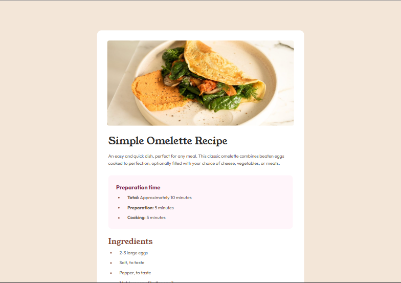

# Frontend Mentor - Recipe page solution

This is a solution to the [Recipe page challenge on Frontend Mentor](https://www.frontendmentor.io/challenges/recipe-page-KiTsR8QQKm). Frontend Mentor challenges help you improve your coding skills by building realistic projects. 

## Table of contents

- [Overview](#overview)
  - [Screenshot](#screenshot)
  - [Links](#links)
- [My process](#my-process)
  - [Built with](#built-with)
  - [What I learned](#what-i-learned)
  - [Continued development](#continued-development)
- [Author](#author)

## Overview

### Screenshot

### Links

- Solution URL: [Frontend Mentor Solution](https://www.frontendmentor.io/solutions/responsive-recipe-page-vUDE07vAb8)
- Live Site URL: [Github Pages Site](https://techbrobolu.github.io/frontend-mentor-challenges/newbie/recipe-page/)

## My process

### Built with

- Semantic HTML5 markup
- CSS custom properties
- Flexbox
- Mobile-first workflow
- Google Fonts (Outfit & Young Serif)

### What I learned

This project helped me practice creating a clean, readable recipe card layout. Key learnings include:

- Working with semantic HTML to structure recipe content
- Implementing responsive design for mobile and desktop views
- Using CSS custom properties for consistent styling
- Creating accessible and well-organized content sections

### Continued development

Areas I want to continue focusing on:

- Further refinement of responsive design techniques
- Improving CSS organization and maintainability
- Enhancing accessibility features
- Practicing pixel-perfect design implementation

## Author

- Frontend Mentor - [Bolu👨🏾‍💻🚀](https://www.frontendmentor.io/profile/techbrobolu)
- Github - [Bolu👨🏾‍💻🚀](https://github.com/techbrobolu)
- X (Formerly Twitter) - [@techbrobolu](https://x.com/techbrobolu)
