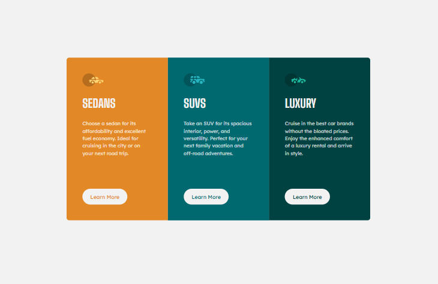

# Frontend Mentor - 3-column preview card component

This is a solution to the [3-column preview card component challenge on Frontend Mentor](https://www.frontendmentor.io/challenges/3column-preview-card-component-pH92eAR2-). Frontend Mentor challenges help you improve your coding skills by building realistic projects.

## Table of contents

- [Overview](#overview)
  - [The challenge](#the-challenge)
  - [Screenshot](#screenshot)
  - [Links](#links)
- [My process](#my-process)
  - [Built with](#built-with)
  - [What I learned](#what-i-learned)
  - [Continued development](#continued-development)
  - [Useful resources](#useful-resources)
- [Author](#author)

## Overview

### The challenge

Users should be able to:

- View the optimal layout depending on their device's screen size
- See hover states for interactive elements

### Screenshot

### Links

- Solution URL: [Frontend Mentor Solution](https://www.frontendmentor.io/solutions/responsive-3-column-preview-card-fK1qAU6LNw)
- Live Site URL: [Github Pages Site](https://techbrobolu.github.io/frontend-mentor-challenges/newbie/3-column-preview-card-component/)

## My process

### Built with

- Semantic HTML5 markup
- CSS custom properties
- Flexbox
- Mobile-first workflow

### What I learned

This project helped reinforce responsive layout and card design patterns:

- Creating a three-column card layout that stacks on smaller screens
- Using Flexbox for consistent alignment and equal-height columns
- Implementing hover and focus states for interactive elements

### Continued development

Areas I want to focus on in future projects:

- Improving accessibility and keyboard navigation
- Exploring CSS Grid for alternative layout solutions
- Adding subtle animations and micro-interactions

### Useful resources

- [CSS Tricks - A Complete Guide to Flexbox](https://css-tricks.com/snippets/css/a-guide-to-flexbox/)

## Author

- Frontend Mentor - [Bolu👨🏾‍💻🚀](https://www.frontendmentor.io/profile/techbrobolu)
- Github - [Bolu👨🏾‍💻🚀](https://github.com/techbrobolu)
- X (Formerly Twitter) - [@techbrobolu](https://x.com/techbrobolu)
