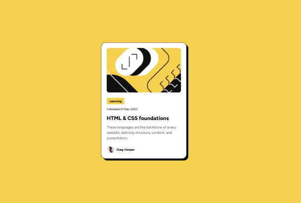

# Frontend Mentor - Blog preview card solution

This is a solution to the [Blog preview card challenge on Frontend Mentor](https://www.frontendmentor.io/challenges/blog-preview-card-ckPaj01IcS). Frontend Mentor challenges help you improve your coding skills by building realistic projects.

## Table of contents

- [Overview](#overview)
  - [The challenge](#the-challenge)
  - [Screenshot](#screenshot)
  - [Links](#links)
- [My process](#my-process)
  - [Built with](#built-with)
  - [What I learned](#what-i-learned)
  - [Continued development](#continued-development)
  - [Useful resources](#useful-resources)
- [Author](#author)

## Overview

### The challenge

Users should be able to:

- See hover and focus states for all interactive elements on the page

### Screenshot



### Links

- Solution URL: [Frontend Mentor Solution](https://www.frontendmentor.io/solutions/blog-preview-card-bJhxfiRn7s)
- Live Site URL: [Github Pages Site](https://techbrobolu.github.io/frontend-mentor-challenges/newbie/blog-preview-card/)

## My process

### Built with

- Semantic HTML5 markup
- CSS custom properties
- Flexbox
- Mobile-first workflow
- Modern CSS features (CSS Nesting)
- Google Fonts (Figtree)

### What I learned

This project was an excellent opportunity to practice creating a polished card component with modern CSS techniques:

**1. CSS Custom Properties for Design Tokens**

I organized all design values as CSS variables, making the code highly maintainable and following a design token approach:

```css
:root {
  --yellow: #f4d04e;
  --spacing-300: 1.5rem;
  --text-preset-1: 800 min(5.5vw, 1.5rem) / 1.5 var(--ff);
  --card-shadow: 8px 8px rgba(0, 0, 0, 1);
}
```

**2. Responsive Typography with min()**

Using the `min()` function for fluid typography ensures text scales appropriately across different screen sizes:

```css
--text-preset-1: 800 min(5.5vw, 1.5rem) / 1.5 var(--ff);
```

**3. CSS Nesting**

Leveraged modern CSS nesting syntax for cleaner, more readable styles:

```css
.blog-title {
  font: var(--text-preset-1);

  &:hover {
    color: var(--yellow);
  }
}
```

**4. Box Shadow for Depth**

Created a distinct shadow effect that gives the card a bold, modern appearance:

```css
box-shadow: var(--card-shadow);
```

**5. Background Image Positioning**

Used a clean approach for the blog image using CSS background properties:

```css
.blog-image {
  background: no-repeat center/cover url("./assets/blog-image.png");
}
```

### Continued development

Areas I want to continue focusing on in future projects:

- **Advanced CSS Grid**: Explore more complex grid layouts for card arrangements
- **Animation**: Add smooth transitions and micro-interactions to enhance user experience
- **Accessibility**: Improve keyboard navigation and screen reader support
- **Component Architecture**: Practice creating reusable, modular component patterns
- **CSS Container Queries**: Implement container queries for more flexible responsive components

### Useful resources

- [MDN - CSS Nesting](https://developer.mozilla.org/en-US/docs/Web/CSS/CSS_nesting) - Helped me understand the modern CSS nesting syntax and how to use it effectively
- [MDN - min() function](https://developer.mozilla.org/en-US/docs/Web/CSS/min) - Essential for understanding fluid typography techniques
- [Google Fonts](https://fonts.google.com/) - Easy integration of the Figtree font family

## Author

- Frontend Mentor - [Bolu👨🏾‍💻🚀](https://www.frontendmentor.io/profile/techbrobolu)
- Github - [Bolu👨🏾‍💻🚀](https://github.com/techbrobolu)
- X (Formerly Twitter) - [@techbrobolu](https://x.com/techbrobolu)
