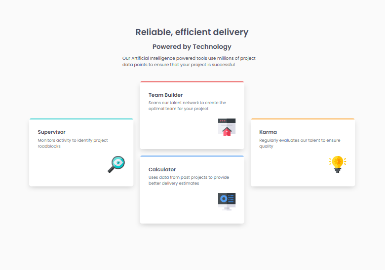

# Frontend Mentor - Four card feature section solution

This is a solution to the [Four card feature section challenge on Frontend Mentor](https://www.frontendmentor.io/challenges/four-card-feature-section-weK1eFYK). Frontend Mentor challenges help you improve your coding skills by building realistic projects. 

## Table of contents

- [Overview](#overview)
  - [The challenge](#the-challenge)
  - [Screenshot](#screenshot)
  - [Links](#links)
- [My process](#my-process)
  - [Built with](#built-with)
  - [What I learned](#what-i-learned)
  - [Continued development](#continued-development)
- [Author](#author)

## Overview

### The challenge

Users should be able to:

- View the optimal layout for the site depending on their device's screen size

### Screenshot

### Links

- Solution URL: [Frontend Mentor Solution](https://www.frontendmentor.io/solutions/responsive-four-card-feature-section-FdHniXMtqN)
- Live Site URL: [Github Pages Site](https://techbrobolu.github.io/frontend-mentor-challenges/newbie/four-card-feature-section/)

## My process

### Built with

- Semantic HTML5 markup
- CSS custom properties
- Flexbox
- CSS Grid
- Mobile-first workflow
- Google Fonts (Poppins)

### What I learned

This project helped me practice creating a complex card layout with an asymmetric grid design. Key learnings include:

- Building a unique four-card layout where cards are positioned at different vertical alignments
- Using CSS Grid to create the distinctive layout (one card on the left, two stacked in the center, one on the right)
- Implementing colored top borders to distinguish different features
- Creating responsive card designs that stack vertically on mobile and form the asymmetric layout on desktop
- Structuring a header section with different font weights for visual hierarchy
- Working with box shadows to add depth to card components
- Positioning decorative icons within cards using Flexbox or absolute positioning

### Continued development

Areas I want to continue focusing on:

- Mastering CSS Grid for complex asymmetric layouts
- Refining responsive breakpoints for smooth transitions between layouts
- Improving card design patterns with borders, shadows, and spacing
- Enhancing grid-based designs that combine both centered and offset elements
- Practicing layouts that use vertical alignment creatively

## Author

- Frontend Mentor - [Bolu👨🏾‍💻🚀](https://www.frontendmentor.io/profile/techbrobolu)
- Github - [Bolu👨🏾‍💻🚀](https://github.com/techbrobolu)
- X (Formerly Twitter) - [@techbrobolu](https://x.com/techbrobolu)
